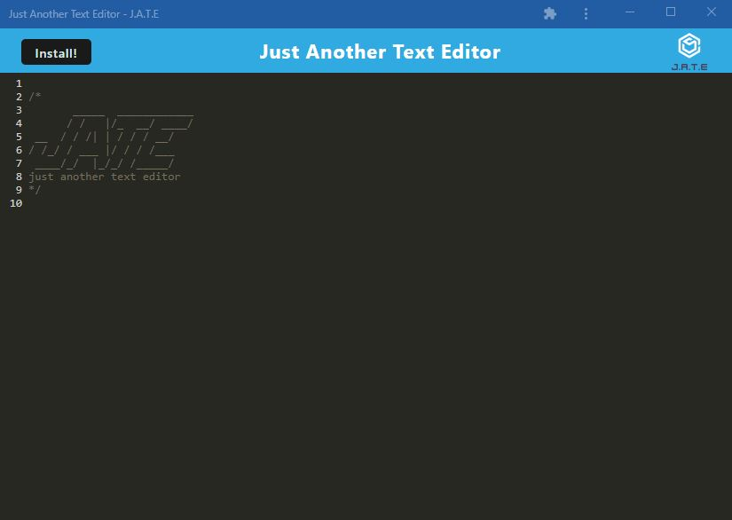

# Text Editor 


## Description

The text editor web application is a modern, offline-capable editor with client-server architecture. It uses Next-gen JavaScript, IndexedDB for local storage, and Service Workers for offline functionality. It is bundled with webpack, can be deployed to Heroku, and supports features like pre-caching static assets and desktop installation.

## Table of Contents

- [Installation](#installation)
- [Usage](#usage)
- [Dependencies](#dependencies)
- [Live Application](#live-application)
- [Screenshot](#screenshot)
- [License](#license)
- [Contributing](#contributing)

## Installation

1. Clone the repository from GitHub.
2. Navigate to the project directory using ``` cd pwa-text_editor```
3. Install the dependencies using ```npm install```
4. Build the application using webpack: ```npm run build```
5. Start the backend server and serve the client: ``` npm run start```
6. Open your web browser and access the application at http://localhost:3000.


## Usage

Once you have successfully installed and started the application, follow these steps to use the Text Editor application:

### 1. Using the Text Editor:

- Open the application in your browser after comepleting the installation or click [here](https://edittextapp.herokuapp.com/) to run the live app. The Text Editor application should load immediately and an IndexedDB database storage is automatically created in the background. 

- To create a new document, simply start typing in the editor. As you enter content and click off of the DOM window, the content will be auto-saved to IndexedDB.

- If you close the editor and reopen it, you will find your content still there, retrieved from our IndexedDB.

### 2. Downloading the Application:

- If you'd like to install this web application for easier access, click on the Install button provided on the webpage. The application will be downloaded and can be accessed as an icon on your desktop.

### 3. Offline Access:

- The application features a registered service worker using Workbox. This allows for precaching of static assets for smooth offline functionality.

## Dependencies

This project utilizes multiple dependencies, both for development and in production. They are separated between the server side and the client side of the application.

### Global dependencies:

- express: ^4.17.1
- if-env: ^1.0.4

### Global devDependencies:

- concurrently: ^5.2.0
- html-webpack-plugin: ^5.5.1
- nodemon: ^2.0.4
- webpack: ^5.86.0
- webpack-cli: ^5.1.4
- Server-side dependencies:
- express: ^4.17.1
- Server-side devDependencies:
- nodemon: ^2.0.4

### Client-side devDependencies:

- @babel/core: ^7.15.0
- @babel/plugin-transform-runtime: ^7.15.0
- @babel/preset-env: ^7.15.0
- @babel/runtime: ^7.15.3
- babel-loader: ^8.2.2
- css-loader: ^6.2.0
- html-webpack-plugin: ^5.3.2
- http-server: ^0.11.1
- style-loader: ^3.2.1
- webpack: ^5.51.1
- webpack-cli: ^4.8.0
- webpack-dev-server: ^4.0.0
- webpack-pwa-manifest: ^4.3.0
- workbox-webpack-plugin: ^6.2.4

### Client-side dependencies:

- code-mirror-themes: ^1.0.0
- idb: ^6.1.2

*Note: The versions listed above were accurate at the time of writing this documentation. For the most current versions, please check the package.json files.*

## Live Application

Experience the application in action! The live version of the Text Editor application can be accessed at the following link:

[Live Text Editor Application](https://edittextapp.herokuapp.com/)

Just click the link to begin using the Text Editor web application right in your browser. Happy writing!

## Screenshot




## License

This project is licensed under the MIT license. Click [here](https://opensource.org/licenses/MIT) for more information.

## Contributing

To contribute to this project, please read the installation section and ensure you have a solid understanding of the codebase. Contributions are welcome via pull requests.

## Tests

Currently, there are no automated tests for this application. Testing is performed manually.

## Questions

If you have any questions, you can reach out to me on [GitHub](https://github.com/spamdalfz) or contact me directly at coreyvasser@gmail.com.
